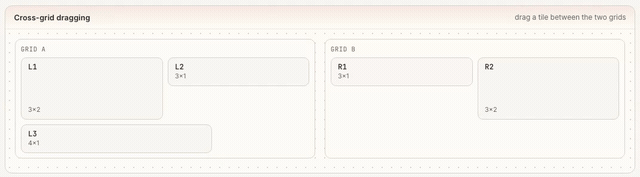

<div align="center">

<picture>
  <source media="(prefers-color-scheme: dark)" srcset="./media/snapgrid-wordmark-dark.png" />
  
</picture>

**A [react-grid-layout](https://github.com/react-grid-layout/react-grid-layout) v2 alternative, built on [dnd-kit](https://github.com/clauderic/dnd-kit).**

Draggable, resizable, responsive grid layouts for **React and Svelte**, with pluggable packing and dragging tiles _between_ grids.

[](./LICENSE)
[](https://www.npmjs.com/package/@snapgridjs/react)
[](https://bundlephobia.com/package/@snapgridjs/react)
[](https://github.com/eleung/snapgrid/actions/workflows/ci.yml)
[](#)

[**Documentation**](https://snapgrid.dev) ·
[Getting Started](https://snapgrid.dev/react/docs/getting-started) ·
[Examples](https://snapgrid.dev/react/examples) ·
[API](https://snapgrid.dev/react/docs/api/overview)

**Bindings:** [React](https://snapgrid.dev/react/docs/getting-started) · [Svelte](https://snapgrid.dev/svelte/docs/getting-started)

<br />



</div>

---

## Why snapgrid

- **Controlled & predictable**: you own the layout array; every change comes back through `onLayoutChange`. No hidden state.
- **Headless-first**: compose `useGridContainer` + hooks under a dnd-kit `DragDropProvider` for full control of your markup — or drop in the turnkey [`<GridLayout>`](https://snapgrid.dev/react/docs/guides/component-layer) (react-grid-layout-style) when you don't need that. Ships **no CSS**.
- **Pluggable packing**: `vertical` / `horizontal` / `none`, plus `masonry` / `gravity` / `shelf` from `@snapgridjs/extras`, or your own `Compactor`.
- **Cross-grid dragging**: wrap grids in a `<SnapGridGroup>` and drag tiles between them.
- **Nested grids**: drop a grid inside a tile of another grid and drag tiles between levels — or isolate a sub-grid by giving it its own provider.
- **dnd-kit interop**: drag between a grid and a dnd-kit `useSortable` list or board — a card lands at a real cell, a tile drops back out, both reorder — under one provider (`snapMove`).
- **Responsive**: per-breakpoint layouts with `<ResponsiveGridLayout>`.
- **Resizable, with limits**: any edge/corner, per-item `minW/maxW/minH/maxH`, and `static` tiles.
- **Keyboard accessible**: every tile is keyboard-draggable — Enter/Space to pick up, arrow keys to move, Esc to cancel.
- **SSR-safe** and **TypeScript-first** (types included).

## snapgrid vs react-grid-layout

snapgrid keeps the parts of [react-grid-layout](https://github.com/react-grid-layout/react-grid-layout) people rely on — the `{ i, x, y, w, h }` layout model, controlled `onLayoutChange`, responsive breakpoints — and adds the things it can't do.

| | snapgrid | react-grid-layout |
| --- | --- | --- |
| Layout model (`{ i, x, y, w, h }`, controlled) | ✅ | ✅ |
| Responsive breakpoints | ✅ | ✅ |
| Resize handles · per-item min/max · static tiles | ✅ | ✅ |
| **Drag tiles _between_ grids** | ✅ built-in (`SnapGridGroup`) | ❌ |
| **Nested grids** | ✅ cross-level dragging | ⚠️ manual |
| **dnd-kit interop** (sortable lists / boards) | ✅ two-way (`snapMove`) | ❌ |
| **Keyboard dragging / a11y** | ✅ Enter · arrows · Esc | ❌ |
| **Headless** (bring your own markup) | ✅ provider + hooks | ❌ renders its own DOM |
| Pluggable packing | ✅ vertical / horizontal / none **+ masonry / gravity / shelf + custom** | vertical / horizontal / none |
| Accept external draggables | ✅ `dropConfig` / `onDrop` | ⚠️ `droppingItem` |
| Styling | unstyled, **ships no CSS** | requires `react-grid-layout.css` + `react-resizable.css` |
| Interaction engine | [dnd-kit](https://dndkit.com/), its latest framework-agnostic core (pointer · touch · keyboard) | react-draggable + react-resizable |
| TypeScript types | ✅ bundled | via `@types/react-grid-layout` |

> react-grid-layout is mature, widely deployed, and battle-tested. This table is about capability differences, not quality. snapgrid is new; if you need a proven incumbent today, RGL is a great choice. Coming from it? See the [migration guide](https://snapgrid.dev/react/docs/guides/migrating-from-rgl).

### Bundle size, honestly

<!-- Figures from apps/docs/components/generated/bundle-size.ts (run `pnpm --filter @snapgridjs/docs measure`). The docs site reads them live; this README mirror is updated by hand. -->

snapgrid itself is ~8 kB brotli, but it's built on [dnd-kit](https://dndkit.com/) (~30 kB), so a fresh install is **~38 kB brotli**, roughly **2.5× react-grid-layout v2's ~15 kB** (minified, React excluded). That weight _is_ dnd-kit, and it's a deliberate trade:

- **dnd-kit is the de-facto standard for drag-and-drop in React.** Its accessible, multi-sensor engine is what gives snapgrid keyboard dragging, touch support, and cross-grid out of the box (things RGL's older react-draggable/react-resizable stack doesn't).
- **If your app already uses dnd-kit, snapgrid adds only ~8 kB.**
- snapgrid tracks dnd-kit's **latest framework-agnostic line** (`@dnd-kit/react`), the line dnd-kit recommends over the legacy `@dnd-kit/core`.

## Install

```sh
# React
pnpm add @snapgridjs/react @dnd-kit/react @dnd-kit/dom

# Svelte 5
pnpm add @snapgridjs/svelte @dnd-kit/svelte @dnd-kit/dom
```

`@snapgridjs/extras` (masonry/gravity/shelf packers) is optional.

## Quick start

snapgrid is **headless-first**: you compose hooks with a dnd-kit `DragDropProvider` and render your own markup. The example below is React; the **Svelte** API mirrors it with `createGridContainer` / `createGridItem` factories and `{@attach}` — see the [Svelte quick start](https://snapgrid.dev/svelte/docs/getting-started).

```tsx
import { DragDropProvider } from "@dnd-kit/react";
import { type Layout, useContainerWidth, useGridContainer, useGridItem } from "@snapgridjs/react";
import { useState } from "react";

export function Board() {
  const { width, containerRef } = useContainerWidth();
  const [layout, setLayout] = useState<Layout>([
    { i: "a", x: 0, y: 0, w: 4, h: 2 },
    { i: "b", x: 4, y: 0, w: 4, h: 2 },
    { i: "c", x: 8, y: 0, w: 4, h: 2 },
  ]);

  // You supply the dnd-kit provider; useGridContainer runs inside it (in Surface).
  return (
    <div ref={containerRef}>
      <DragDropProvider>
        <Surface layout={layout} width={width} onLayoutChange={setLayout} />
      </DragDropProvider>
    </div>
  );
}

function Surface({
  layout,
  width,
  onLayoutChange,
}: { layout: Layout; width: number; onLayoutChange: (next: Layout) => void }) {
  const { containerProps, group } = useGridContainer({ layout, width, onLayoutChange });
  return (
    <div {...containerProps}>
      {layout.map((it) => (
        <Tile key={it.i} id={it.i} group={group} />
      ))}
    </div>
  );
}

function Tile({ id, group }: { id: string; group: string }) {
  const { ref, style } = useGridItem({ id, group });
  return (
    <div ref={ref} style={style} className="tile">
      {id}
    </div>
  );
}
```

**Prefer a ready-made component?** The turnkey [`<GridLayout>`](https://snapgrid.dev/react/docs/guides/component-layer) wraps these same hooks (and supplies the provider) in a react-grid-layout-style API — drop in keyed children and you're done:

```tsx
<GridLayout layout={layout} width={width} onLayoutChange={setLayout}>
  {layout.map((item) => (
    <div key={item.i} className="tile">{item.i}</div>
  ))}
</GridLayout>
```

→ Full walkthrough in [**Getting Started**](https://snapgrid.dev/react/docs/getting-started).

## Packages

| Package | Description |
| --- | --- |
| [`@snapgridjs/react`](./packages/grid-react) | React components + hooks. The main entry point for React. |
| [`@snapgridjs/svelte`](./packages/grid-svelte) | Svelte 5 components + factories. The main entry point for Svelte. |
| [`@snapgridjs/core`](./packages/grid-core) | Framework-agnostic layout math (geometry, move/resize, compaction, drag-session). |
| [`@snapgridjs/dnd`](./packages/grid-dnd) | Framework-agnostic dnd-kit engine (drag/resize/cross-grid/interop) the bindings build on. Comes in with `@snapgridjs/react`; for binding authors. |
| [`@snapgridjs/extras`](./packages/grid-extras) | Optional packers: masonry, gravity, shelf, wrap. |

## Development

This is a [pnpm](https://pnpm.io) workspace.

```sh
pnpm install        # install everything
pnpm dev            # run the docs site (apps/docs) — guides, live examples, showcase
pnpm validate       # typecheck + lint + test + build
```

| Command | Does |
| --- | --- |
| `pnpm test` | Run the Vitest suite. |
| `pnpm lint` / `pnpm lint:fix` | Biome check / autofix. |
| `pnpm typecheck` | Type-check every package. |
| `pnpm build` | Build all packages. |

See [CONTRIBUTING.md](./CONTRIBUTING.md) before opening a PR.

## Acknowledgements

snapgrid stands on the shoulders of [dnd-kit](https://github.com/clauderic/dnd-kit) (the interaction
layer) and [react-grid-layout](https://github.com/react-grid-layout/react-grid-layout) (whose `core`
packing engine it adapts).

## License

[MIT](./LICENSE) © Edmond Leung
